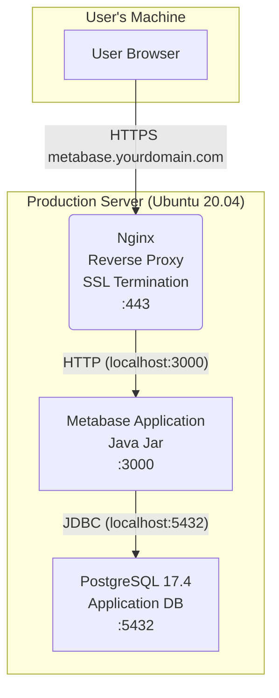

# Metabase Production Setup Guide (Ubuntu 20.04)

This document outlines the steps to set up a production-ready Metabase instance on Ubuntu 20.04 on a single server.

**Goals:**

* Run Metabase using the official JAR file. Requires **Java 21**.
* Use **PostgreSQL 17.4** as the dedicated application database (avoiding the default H2).
* Use **Nginx** as a reverse proxy for SSL termination (HTTPS).
* Ensure Metabase runs as a system service.

Based on recommendations from the [Metabase documentation on running in production](https://www.metabase.com/learn/metabase-basics/administration/administration-and-operation/metabase-in-production).

## Prerequisites

* An Ubuntu 20.04 server instance.
* A domain name pointing to your server's public IP address (e.g., `metabase.yourdomain.com`).
* An SSL certificate for your domain (we'll use Let's Encrypt via Certbot).
* Firewall configured to allow SSH (22), HTTP (80), and HTTPS (443) traffic.

## Architecture Diagram

This diagram shows the planned architecture:



## Setup Steps

### 1. System Update & Software Install

Ensure your system is up-to-date and install software.

```bash
sudo apt update && sudo apt upgrade -y

sudo apt install -y wget curl gnupg software-properties-common ufw zip unzip net-tools
```

Install OpenJDK 21:

```bash
sudo apt install openjdk-21-jre-headless
java --version 
```

Install Nginx and Certbot:

```bash
sudo apt install -y nginx certbot python3-certbot-nginx
```

Install PostgreSQL:

```bash
wget -O - https://www.postgresql.org/media/keys/ACCC4CF8.asc | gpg --dearmor | sudo tee /etc/apt/trusted.gpg.d/apt.postgresql.org.gpg >/dev/null

sudo sh -c 'echo "deb http://apt.postgresql.org/pub/repos/apt $(lsb_release -cs)-pgdg main" > /etc/apt/sources.list.d/pgdg.list'

sudo apt update

sudo apt install -y postgresql-17 postgresql-client-17
```

### 2. Configure Firewall

Allow essential ports. We'll allow Nginx Full (ports 80 & 443) and OpenSSH.

```bash
sudo ufw allow OpenSSH

sudo ufw allow 'Nginx Full'

sudo ufw enable

sudo ufw status
```

### 4.  Configure PostgreSQL Database

Create a dedicated database and user for Metabase. Replace `<strong_password>` with a secure password.

```bash
sudo -u postgres psql -c "CREATE DATABASE metabase_app_db;"
sudo -u postgres psql -c "CREATE USER metabase_user WITH ENCRYPTED PASSWORD '<strong_password>';"
sudo -u postgres psql -c "GRANT ALL PRIVILEGES ON DATABASE metabase_app_db TO metabase_user;"
sudo -u postgres psql -d metabase_app_db -c "GRANT CREATE ON SCHEMA public TO metabase_user;"
sudo -u postgres psql -d metabase_app_db -c "GRANT USAGE ON SCHEMA public TO metabase_user;"
```

Test the new user:

```bash
psql -U metabase_user -d metabase_app_db -h localhost -W
CREATE TABLE permission_test (id INT);
DROP TABLE permission_test;
\q
```

### 7. Install Certbot and Obtain SSL Certificate

We'll use Certbot with the Nginx plugin to automate getting a Let's Encrypt certificate. Replace `metabase.yourdomain.com` with your actual domain and `your_email@example.com` with your email.

Let's start by confirming your domain name and IP address:

1.  **Get Server IP:** `curl -s ifconfig.me` contacts an external service that simply echoes back the public IP address from which the request originated. This gives you the IP address the outside world sees for your server.
2.  **Check Domain DNS:** `dig +short your_domain.com A` queries the DNS system specifically for the `A` record (IPv4 address) associated with `your_domain.com` and shows only the result (the IP address, if found).
3.  Compare the results. If they match, it means the DNS A record is correctly pointing to the server, and Certbot should be able to validate ownership. If not, you need to fix your DNS settings or wait longer for propagation.

Now you can obtain and install the certificate:

```bash
sudo certbot --nginx -d metabase.yourdomain.com --agree-tos --email your_email@example.com --redirect --hsts --staple-ocsp
```

Certbot should automatically modify your Nginx configuration for SSL.

### 8. Configure Nginx as Reverse Proxy

Verify and adjust the Nginx configuration file created/modified by Certbot. It should be located in `/etc/nginx/sites-available/` (likely named after your domain, e.g., `metabase.yourdomain.com`) and symlinked in `/etc/nginx/sites-enabled/`.

Ensure the `location /` block proxies requests to Metabase (which will run on port 3000).

`/etc/nginx/sites-available/metabase.yourdomain.com`

```nginx
server {
    # Your server_name directive
    server_name metabase.yourdomain.com;

    # Proxy requests to Metabase running on port 3000
    location / {
        proxy_set_header X-Forwarded-Proto $scheme;
        proxy_set_header X-Forwarded-For $proxy_add_x_forwarded_for;
        proxy_set_header X-Real-IP $remote_addr;
        proxy_set_header Host $http_host;
        proxy_pass http://127.0.0.1:3000; # Send traffic to Metabase
        proxy_http_version 1.1;
        proxy_set_header Upgrade $http_upgrade;
        proxy_set_header Connection "upgrade";
        # Optional: Increase proxy timeouts for long-running queries
        # proxy_connect_timeout 600s;
        # proxy_send_timeout 600s;
        # proxy_read_timeout 600s;
    }

    # SSL Configuration managed by Certbot should be here...
    listen [::]:443 ssl ipv6only=on; # managed by Certbot
    listen 443 ssl; # managed by Certbot
    ssl_certificate /etc/letsencrypt/live/metabase.yourdomain.com/fullchain.pem; # managed by Certbot
    ssl_certificate_key /etc/letsencrypt/live/metabase.yourdomain.com/privkey.pem; # managed by Certbot
    include /etc/letsencrypt/options-ssl-nginx.conf; # managed by Certbot
    ssl_dhparam /etc/letsencrypt/ssl-dhparams.pem; # managed by Certbot

    # Add security headers (optional but recommended)
    add_header Strict-Transport-Security "max-age=31536000; includeSubDomains" always;
    add_header X-Content-Type-Options nosniff always;
    add_header X-Frame-Options DENY always; # Or SAMEORIGIN if embedding is needed
    add_header Referrer-Policy "strict-origin-when-cross-origin" always;
    # Consider adding Content-Security-Policy header later if needed

}

# HTTP to HTTPS redirect block (should be added by Certbot --redirect)
server {
    if ($host = metabase.yourdomain.com) {
        return 301 https://$host$request_uri;
    } # managed by Certbot

    listen 80;
    listen [::]:80;
    server_name metabase.yourdomain.com;
    return 404; # managed by Certbot
}
```

After editing the Nginx configuration, test it and reload Nginx:

```bash
sudo nginx -t
sudo systemctl reload nginx
```

### 9. Download and Prepare Metabase

Download the latest Metabase JAR file and place it in a suitable directory.

```bash
# Create a directory for Metabase
sudo mkdir -p /opt/metabase
cd /opt/metabase

# Find the latest JAR URL from https://www.metabase.com/start/oss/jar
# Example (replace with the actual latest version URL):
sudo wget -O metabase.jar https://downloads.metabase.com/v0.53.8/metabase.jar

# Create a dedicated user for running Metabase (security best practice)
sudo useradd -r -s /bin/false -d /opt/metabase metabaseuser

# Set ownership for the Metabase directory
sudo chown -R metabaseuser:metabaseuser /opt/metabase
```

### 10. Create Metabase Systemd Service

Create a systemd service file to manage the Metabase application. This ensures it starts on boot and can be easily managed.

Create the file `/etc/systemd/system/metabase.service`:

```systemd
[Unit]
Description=Metabase Application Server
After=syslog.target
After=network.target

# Ensure PostgreSQL is running before Metabase starts
Requires=postgresql.service
After=postgresql.service

[Service]
# Run Metabase as the dedicated 'metabaseuser'
User=metabaseuser
Group=metabaseuser

# Working directory for Metabase
WorkingDirectory=/opt/metabase

# Environment variables for database connection (replace <strong_password>)
Environment="MB_DB_TYPE=postgres"
Environment="MB_DB_DBNAME=metabase_app_db"
Environment="MB_DB_PORT=5432"
Environment="MB_DB_USER=metabase_user"
Environment="MB_DB_PASS=<strong_password>"
Environment="MB_DB_HOST=localhost"
Environment="MB_SITE_URL=https://metabase.yourdomain.com"
# Optional: Change the port Metabase listens on if needed (default 3000)
# Environment="MB_JETTY_PORT=3000"


# Path to Java executable
# Java path can be checked with the output of `readlink -f $(which java)`
ExecStart=/usr/lib/jvm/java-21-openjdk-amd64/bin/java -jar metabase.jar

# Standard output and error logging
StandardOutput=syslog
StandardError=syslog
SyslogIdentifier=metabase

# Restart policy
Restart=always
RestartSec=5

# Process management
SuccessExitStatus=143
TimeoutStopSec=10

[Install]
WantedBy=multi-user.target
```

**Important:**

1. **Replace `<strong_password>`** with the actual PostgreSQL password you set.
2. **Verify `ExecStart=` Java path:** Use `readlink -f $(which java)` to find the *absolute path* to the Java 21 executable and replace the example path in `ExecStart`. If `sdkman` was used by a non-root user, this path might be under that user's home directory. Ensure the `metabaseuser` can *execute* this Java binary. If permissions are an issue, consider installing Java system-wide (`sudo apt install openjdk-21-jdk`) instead of using `sdkman` for a service, or adjust file permissions carefully (less recommended).
3. Optionally uncomment and set `MB_SITE_URL`.

### 11. Start and Enable Metabase Service

Reload systemd, start the Metabase service, and enable it to start on boot.

```bash
sudo systemctl daemon-reload

sudo systemctl enable metabase

# Check the status
sudo systemctl status metabase
```

Check the logs for any errors:

```bash
sudo journalctl -u metabase -f
```

Look for lines indicating Metabase is starting up and connecting to the PostgreSQL database. Initial startup and database migrations can take a few minutes.

### 12. Access Metabase

Open your web browser and navigate to `https://metabase.yourdomain.com`. You should see the Metabase setup screen. Follow the on-screen instructions to create your first admin user. Metabase should already be configured to use the PostgreSQL database based on the environment variables set in the service file.

### 13. Regular Maintenance

* **Backups:** Regularly back up the PostgreSQL `metabase_app_db` database.
* **Updates:** Keep Metabase, Java, PostgreSQL, Nginx, and the OS updated. Check the Metabase release notes before upgrading.
* **SSL Renewal:** Certbot should automatically handle SSL certificate renewals via a systemd timer or cron job (`sudo systemctl list-timers | grep certbot`, `sudo certbot renew --dry-run`). Monitor this occasionally.
* **Log Monitoring:** Monitor Metabase logs (`journalctl -u metabase`) and system logs for issues.

Congratulations! You should now have a production-ready Metabase instance running.
